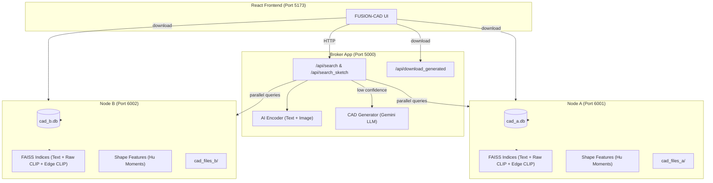
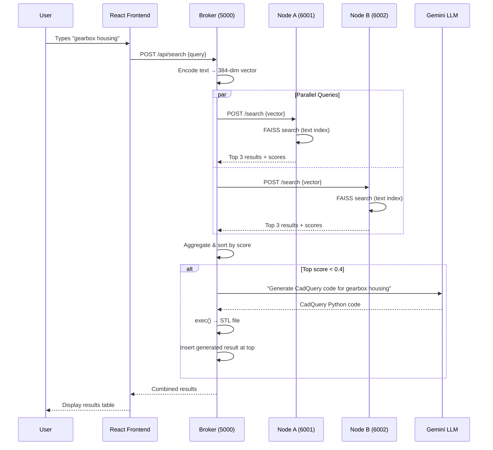
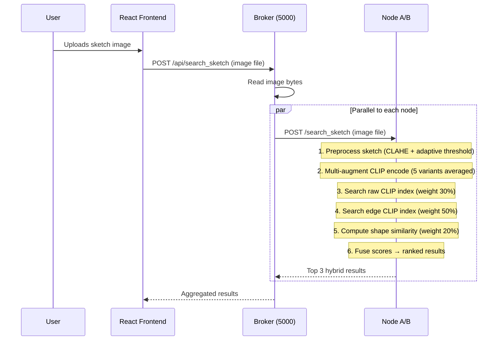
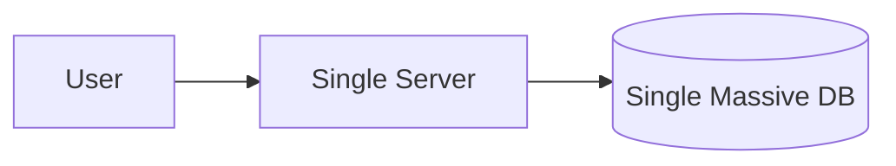
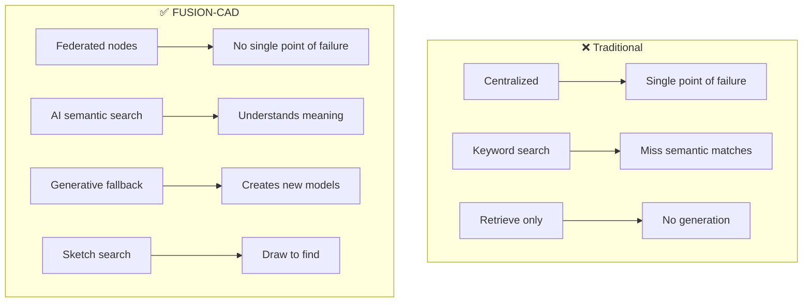

# FUSION-CAD: Physical-Probe Federated Generative CAD Broker

## Complete System Documentation

---

## 1. What This Application Does

FUSION-CAD is a **federated search and generative CAD system** that allows engineers to find CAD drawings across distributed databases using **natural language** or **hand-drawn sketches**. When no match exists in any database, it **generates a new 3D model** on the fly using AI.

### Core Capabilities

| Feature | Description |
|---------|-------------|
| **Text Search** | Type "fuel tank 500L" → AI finds the most similar CAD assets across all nodes |
| **Sketch Search** | Upload/draw a rough sketch → AI matches it to real CAD drawings |
| **Generative Fallback** | If nothing matches well → AI generates a brand new 3D CAD model (STL) |
| **Federated Architecture** | Nodes can run on different machines, each with their own private database |
| **Live Asset Ingestion** | Add new CAD files (PDFs) to any node without restarting |

---

## 2. System Architecture



### Data Flow: Text Search



### Data Flow: Sketch Search



---

## 3. Component Breakdown

### 3.1 React Frontend (`frontend/src/App.jsx`)

| Feature | Implementation |
|---------|---------------|
| Node health monitoring | Polls `/api/nodes` every 15 seconds, shows green/red dots |
| Text search | POST to `/api/search` with JSON body |
| Sketch upload | POST to `/api/search_sketch` with FormData |
| Result display | Table with name, description, source node, confidence badge |
| Download | Direct link to node server or broker's `/api/download_generated` |
| Asset ingestion | POST to node's `/add` endpoint with file + metadata |

### 3.2 Broker App (`broker_app.py`)

The orchestrator. It does **NOT** store any CAD assets itself.

| Responsibility | How |
|----------------|------|
| Text encoding | Uses `ai_encoder.encoder.encode_text()` to convert query → 384-dim vector |
| Parallel probing | `ThreadPoolExecutor` sends the same query to all nodes simultaneously |
| Result aggregation | Flattens all node responses, sorts by score descending |
| Generative fallback | If best score < 0.4, calls `generation.cad_synthesis.generate_model()` |
| Serving generated files | `/api/download_generated` serves STL files from `static/generated/` |

### 3.3 Node Servers (`node_a.py`, `node_b.py`)

Each node is a self-contained search engine with its own database.

**At startup:**
1. Loads all assets from SQLite (`cad_assets` table: name, description, file_path)
2. Converts PDFs to PNGs using Poppler
3. Builds **3 FAISS indices**:
   - **Text index** (384-dim, sentence-transformers) — for text queries
   - **Raw CLIP index** (512-dim, CLIP ViT-B/32) — for image similarity
   - **Edge CLIP index** (512-dim, CLIP on edge-extracted images) — bridges sketch-to-CAD domain gap
4. Computes **shape features** (Hu moments + contour descriptors) for each asset

**At search time (text):** Receives 384-dim vector → FAISS `IndexFlatIP` inner product search → returns top-K

**At search time (sketch):**
1. Preprocesses sketch: CLAHE → adaptive threshold → morphological cleanup → center crop → rotation normalize
2. Multi-augmentation CLIP encode (5 variants: original, scale up, scale down, flip, blur → averaged)
3. Searches **both** raw and edge CLIP indices
4. Computes contour shape similarity
5. Fuses scores: `0.3 × raw + 0.5 × edge + 0.2 × shape`

### 3.4 AI Encoder (`ai_encoder.py`)

The universal multimodal encoder. Singleton pattern — loaded once, shared across the app.

| Method | Input | Output | Used For |
|--------|-------|--------|----------|
| `encode_text(text)` | String | 384-dim vector | Text search |
| `encode_image(source, partial)` | Image path/file/PIL | 512-dim vector | Sketch & DB image encoding |
| `encode_image_edges(source)` | Image path/file | 512-dim vector | Edge-domain DB index |
| `compute_shape_features(source)` | Image path/file | 8-dim vector | Contour shape matching |
| `_multi_augment_encode(pil_img)` | PIL Image | 512-dim vector | Robust sketch encoding |

**Models used:**
- **all-MiniLM-L6-v2** (sentence-transformers): Text → 384-dim. Lightweight, fast, good for semantic similarity
- **CLIP ViT-B/32** (OpenAI): Image → 512-dim. Pre-trained on 400M image-text pairs

### 3.5 Sketch Preprocessing (`geometry/silhouette.py`)

Transforms raw sketches into clean representations for encoding:

| Function | What It Does |
|----------|-------------|
| `extract_silhouette()` | CLAHE contrast → adaptive threshold → morphological close/open |
| `extract_edges()` | CLAHE → bilateral filter → auto-Canny → dilate |
| `center_crop()` | Bounding box → aspect-preserving resize with 10% padding |
| `normalize_rotation()` | PCA-like alignment using image moments |
| `compute_hu_moments()` | 7 rotation/scale-invariant Hu moment descriptors |
| `compute_contour_features()` | Circularity, aspect ratio, solidity, extent + top 4 Hu moments |
| `preprocess_for_clip()` | Full pipeline: silhouette → crop → normalize → invert to white bg |
| `preprocess_db_image_edges()` | Edge extraction for DB images (same domain as sketches) |

### 3.6 CAD Generator (`generation/cad_synthesis.py`)

Generates 3D models when no database match is found.

**Flow:**
1. Receives natural language query (e.g., "gearbox with mounting holes")
2. Sends crafted prompt to **Google Gemini `gemini-2.0-flash`** (free tier)
3. Gemini returns CadQuery Python code
4. Code is executed in a **restricted namespace** (only `cq` module + basic builtins)
5. Result exported as STL to `static/generated/`
6. If anything fails → fallback to a parametric box shape

**Safety:** The `exec()` namespace is sandboxed — no file I/O, no imports, no network access.

### 3.7 LLM Config (`generation/llm_config.py`)

Stores the Gemini API key and the system prompt that instructs the LLM to write valid CadQuery code.

### 3.8 Database Schema

```sql
CREATE TABLE cad_assets (
    id INTEGER PRIMARY KEY AUTOINCREMENT,
    name TEXT NOT NULL,
    description TEXT,
    file_path TEXT NOT NULL  -- relative to BASE directory
);
```

Each node has its own SQLite database (`cad_a.db`, `cad_b.db`).

---

## 4. Technology Stack

| Layer | Technology | Why |
|-------|-----------|-----|
| Frontend | React + Vite | Modern, fast HMR, component-based |
| Backend (Broker) | Flask + Flask-CORS | Lightweight, easy routing |
| Backend (Nodes) | Flask | Same, independent services |
| Text Embeddings | sentence-transformers (MiniLM) | Fast, 384-dim, good semantic quality |
| Image Embeddings | OpenAI CLIP ViT-B/32 | Pre-trained on 400M pairs, zero-shot capable |
| Vector Search | FAISS (faiss-cpu) | Facebook's library, optimized for similarity search |
| Image Processing | OpenCV | Industry standard, feature-rich |
| CAD Engine | CadQuery | Parametric 3D modeling in Python |
| Generative AI | Google Gemini 2.0 Flash | Free tier, generates CadQuery code |
| Database | SQLite | Zero-config, file-based, perfect for per-node storage |
| PDF Processing | pdf2image + Poppler | Converts CAD PDFs to images for encoding |

---

## 5. Problems with Traditional Architecture

### 5.1 Centralized CAD Libraries

Traditional systems use a single centralized database/server:



| Problem | Impact |
|---------|--------|
| **Single point of failure** | Server goes down → entire system unavailable |
| **Data sovereignty** | Organizations must upload proprietary CAD to a shared server |
| **Scalability bottleneck** | One server handles all queries, indexing, and file serving |
| **Network dependency** | All data must be transferred to the central server |
| **Security risk** | All CAD IP in one place → high-value attack target |

### 5.2 Keyword-Based Search

Traditional CAD libraries use filename/tag matching:

| Problem | Example |
|---------|---------|
| **Exact match only** | Searching "fuel vessel" won't find "storage tank" even though they're the same thing |
| **No semantic understanding** | Can't understand that "500L cylindrical container" ≈ "fuel tank" |
| **No sketch search** | Engineers can't draw what they're looking for |
| **No fallback** | If nothing matches, you get zero results — no generation |
| **Manual tagging** | Every asset needs human-tagged keywords to be searchable |

### 5.3 No Generative Capability

Traditional systems can only **retrieve** — they cannot **create**:

| Scenario | Traditional | FUSION-CAD |
|----------|------------|------------|
| "gearbox housing" not in DB | ❌ "No results found" | ✅ AI generates a 3D gearbox model |
| Engineer has rough sketch | ❌ Must know exact filename | ✅ Upload sketch → find similar parts |
| New part needed | ❌ Start from scratch in CAD software | ✅ Get an AI-generated starting point |

### 5.4 What FUSION-CAD Solves



---

## 6. Future Improvements

### 6.1 High Priority

| Improvement | Effort | Impact |
|-------------|--------|--------|
| **Fine-tune CLIP on CAD sketch-drawing pairs** | 1-2 days | Sketch accuracy jumps from ~70% to 90%+ |
| **3D STL preview in UI** | 1 day | Show generated models in browser using Three.js |
| **Version control for assets** | 2 days | Track revisions of CAD files |
| **Authentication & access control** | 1-2 days | JWT tokens, per-node permissions |

### 6.2 Medium Priority

| Improvement | Effort | Impact |
|-------------|--------|--------|
| **Auto-discovery of nodes** | 1 day | Nodes register themselves instead of hardcoded IPs |
| **Caching layer** | 1 day | Redis/LRU cache for repeated queries |
| **Batch ingestion** | 1 day | Upload ZIP of multiple CAD files at once |
| **STEP/IGES file support** | 2 days | Beyond PDF — native 3D format support |
| **Result explanation** | 1 day | Show WHY a result matched (which features aligned) |

### 6.3 Advanced / Research

| Improvement | Effort | Impact |
|-------------|--------|--------|
| **Custom-trained model** | 3-5 days | Train on domain-specific CAD data (ShapeNet, ABC dataset) |
| **GNN-based shape matching** | 1-2 weeks | Graph neural network on mesh topology for true 3D similarity |
| **Multi-view encoding** | 3 days | Encode CAD from multiple angles (front, side, top) → richer representation |
| **Collaborative filtering** | 1 week | "Engineers who used this tank also used this valve" |
| **Parametric editing UI** | 1 week | Slider controls to modify generated models (resize, add features) |
| **Federated learning** | 2 weeks | Nodes improve their own models without sharing raw data |
| **Natural language refinement** | 2 days | "Make it wider", "Add flanges" → iterative generation |

### 6.4 Deployment & Production

| Improvement | Effort | Impact |
|-------------|--------|--------|
| **Docker containers** | 1 day | Each node as a Docker image for easy deployment |
| **HTTPS / TLS** | 0.5 day | Encrypted communication between nodes |
| **Load balancing** | 1 day | Multiple instances of each node behind a load balancer |
| **Monitoring & logging** | 1 day | Prometheus/Grafana for query latency, node health |
| **GPU acceleration** | 0.5 day | CUDA-enabled CLIP encoding for faster search |

---

## 7. File Structure

```
PhysicalProbe/
├── broker_app.py              # Central orchestrator (port 5000)
├── node_a.py                  # Node A server (port 6001)
├── node_b.py                  # Node B server (port 6002)
├── ai_encoder.py              # Universal multimodal encoder (CLIP + MiniLM)
├── parameter_adjuster.py      # CLI tool for regenerating models
├── create_db_a.py             # Database creation script for Node A
├── create_db_b.py             # Database creation script for Node B
├── cad_a.db                   # Node A SQLite database
├── cad_b.db                   # Node B SQLite database
├── requirements.txt           # Python dependencies
│
├── generation/
│   ├── cad_synthesis.py       # LLM-based CadQuery code generation
│   ├── llm_config.py          # Gemini API key + system prompt
│   └── tank_generator.py      # Legacy tank generator (unused)
│
├── geometry/
│   ├── silhouette.py          # Sketch preprocessing + feature extraction
│   └── encoder.py             # DINOv2 encoder (available for future use)
│
├── frontend/
│   └── src/
│       ├── App.jsx            # Main React component
│       ├── App.css            # Application styles
│       ├── main.jsx           # React entry point
│       └── index.css          # Global styles
│
├── static/
│   ├── generated/             # AI-generated STL files
│   ├── css/                   # Static CSS
│   └── images/                # Static images
│
├── cad_files_a/               # Node A CAD files (PDFs + PNGs)
├── cad_files_b/               # Node B CAD files (PDFs + PNGs)
└── templates/
    └── index.html             # Legacy Jinja template (replaced by React)
```

---

## 8. How to Run

```bash
# Terminal 1: Node A
python node_a.py               # Starts on port 6001

# Terminal 2: Node B
python node_b.py               # Starts on port 6002

# Terminal 3: Broker
python broker_app.py           # Starts on port 5000

# Terminal 4: React Frontend
cd frontend && npm run dev     # Starts on port 5173
```

**Environment variable (optional):**
```bash
set GOOGLE_API_KEY=your_gemini_key    # For CAD generation
```

---

## 9. API Reference

### Broker Endpoints

| Method | Endpoint | Body | Response |
|--------|----------|------|----------|
| POST | `/api/search` | `{"query": "fuel tank"}` | `{"results": [...]}` |
| POST | `/api/search_sketch` | FormData with `image` file | `{"results": [...]}` |
| GET | `/api/nodes` | — | `{"NODE_A": "online", "NODE_B": "offline"}` |
| GET | `/api/download_generated?file=generated/xxx.stl` | — | STL file download |

### Node Endpoints

| Method | Endpoint | Body | Response |
|--------|----------|------|----------|
| POST | `/search` | `{"vector": [384 floats]}` | `[{name, description, file, score, node}]` |
| POST | `/search_sketch` | FormData with `image` file | `[{name, description, file, score, node}]` |
| GET | `/download?file=cad_files_a/xxx.pdf` | — | File download |
| POST | `/add` | FormData: name, description, file | `{"status": "success"}` |
